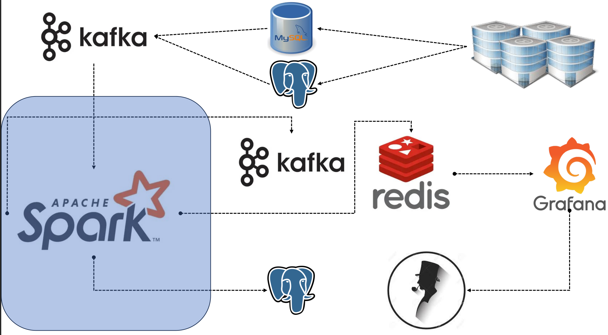
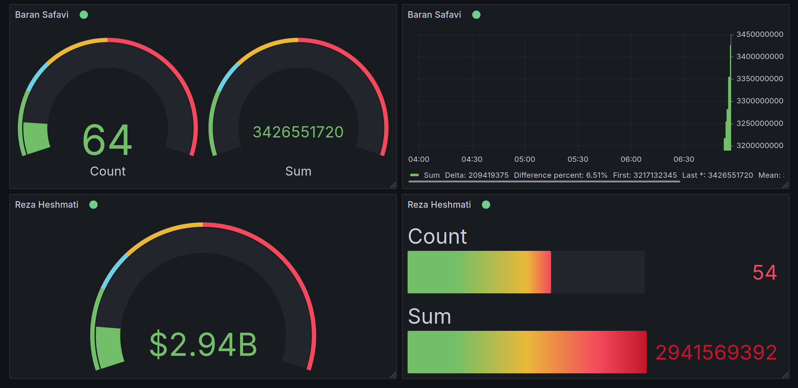

# Fraud-Detection Dashboard

**Fraud Detection Data Engineering Project**:  
Detecting Fraud in Shopping Centers and Tracking Sellers Using **Apache Spark, Apache Kafka, Redis, PostgreSQL, Prometheus, Grafana**

  

- Debezium images used in Docker Compose for CDC (Change Data Capture)
- PostgreSQL and MySQL as Databases for transactional data (Data Source Layer)
- Kafka as a Message Broker and to store processed data for notification jobs (Data Ingestion Layer)
- Spark as a Processing/Transformation Unit (Data Processing Layer)
- Redis as a super-fast storage for real-time communication with Grafana
- Grafana for Monitoring Tasks and Dashboarding

  
<strong>Preview of Grafana Dashboard:</strong>

  

